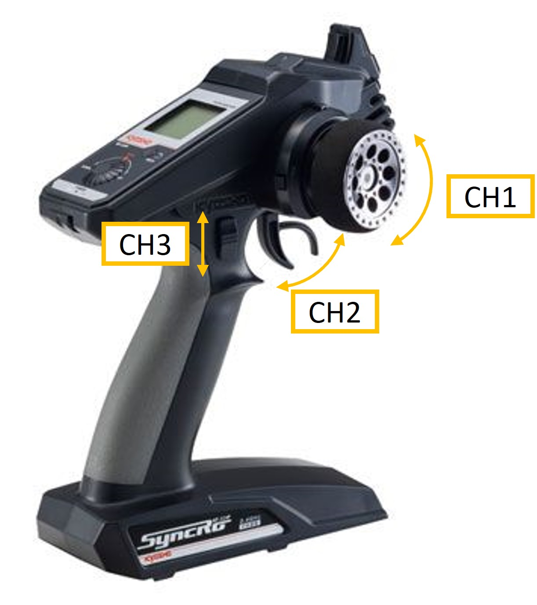
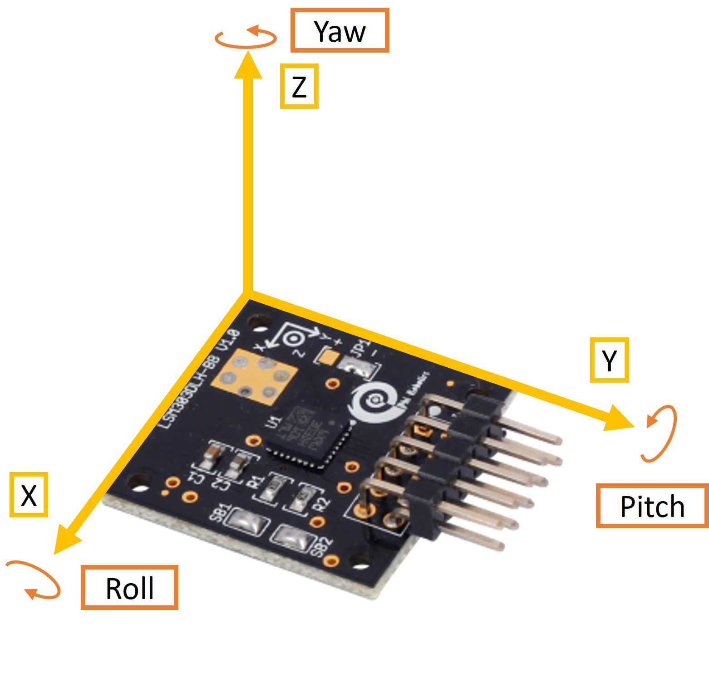
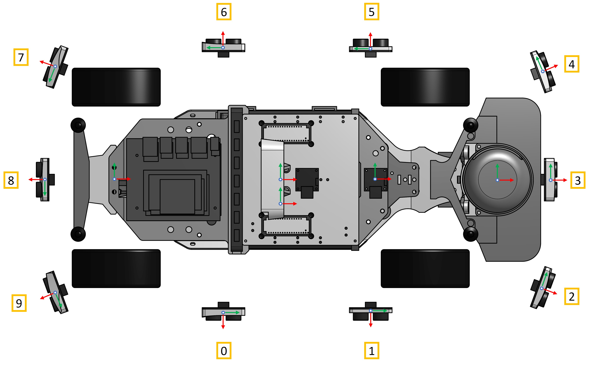
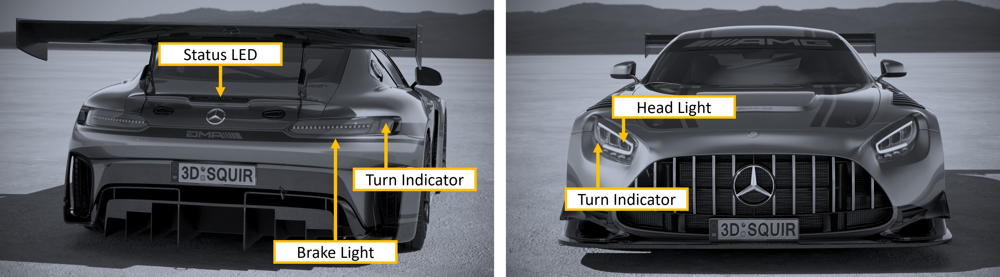

# STM32 Nucelo Messages

## RC Control

```
rostopic: /veh_remote_control
msg: std_msgs/UInt16MultiArray
data: [CH1, CH2, CH3]
```

 </br>



</br>

## IMU

```
rostopic: /imu
msg: std_msgs/Float32MultiArray
units: acceleration [m/s²], angular rate [°/s], temperature [°C]
range: acceleration [± 4g], angular rate [± 500 °/s], temperature [-40°C, 85°C]
data: [x, y, z, roll, pitch, yaw, temp]
```



</br>

## Ultrasonic Sensors

```
rostopic: /uss_values
msg: std_msgs/Int16MultiArray
data: [0, 1, 2, 3, 4, 5, 6, 7, 8, 9]
range: 0 - 150cm
exception: sensor not detected (255), out of range (-1) 
```



## Lights

```python
rostopic: /lights
msg: std_msgs/UInt16MultiArray
info: 'The turn signals as well as the high beam can flash. The cycles specify how often the flashing pattern is repeated. Each cycle is defined by an on duration [ms] and an off duration [ms].'
data: [
0, # headlights (0) off, (1) on, (2) high beam only
0, # highbeam on [ms]
0, # highbeam off [ms]
0, # highbeam cycles
0, # indicators (0) off, (1) left, (2) right, (3) hazard
0, # indicators on [ms]
0, # indicators off [ms]
0, # indicator cycles
0, # rear_light (0) off, (1) breake light (2) additional breake light
]
```

```python
rostopic: /brake_light
msg: std_msgs/UInt16MultiArray
info: 'The status LED has two functions. It can be used either as an additional brake light or as an RGB status LED.'
data: [
0, # R [0, 255]
0, # G [0, 255]
0, # B [0, 255]
0, # on [ms]
0, # off [ms]
0, # cycles (0) contineously on, (N) N loops
]
```



