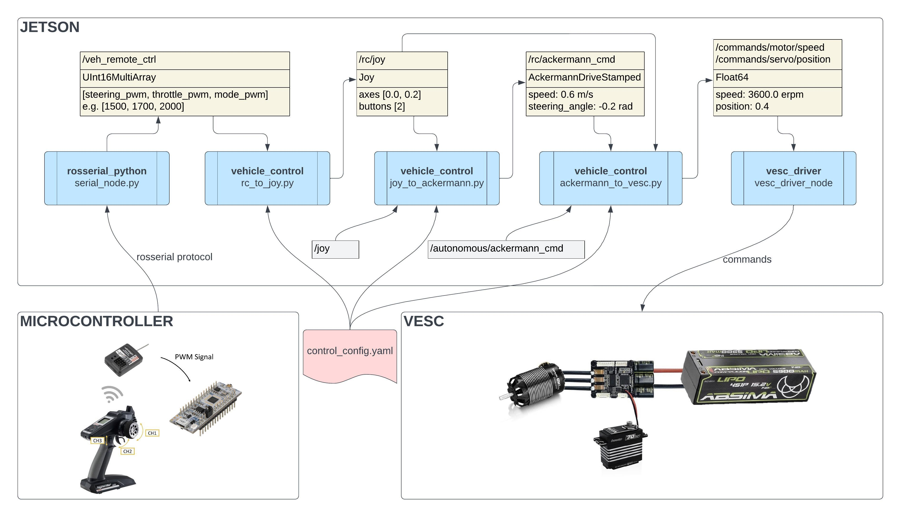

# MXcarkit Vehicle Control

This document outlines the control mechanisms of the MXcarkit vehicle, detailing the process from input reception to action execution, as visualized in the flowchart below.

 

The MXCarKit's control process begins with a remote control sending an RC signal to a receiver, which is then transmitted to a microcontroller. This microcontroller reads the PWM signal and sends it to the Jetson via USB using the rosserial protocol. On the Jetson, a rosserial node receives this data and passes it through Python nodes that convert the PWM signal into VESC commands. The VESC, an electronic speed controller, then operates the motor and steering based on these commands, enabling the vehicle to move according to the remote control inputs. 

## RC to JOY

The `rc_to_joy.py` node subscribes to the `/veh_remote_ctrl` topic, published by the `rosserial_python` node. This message, of type `UInt16MultiArray`, contains the PWM (Pulse Width Modulation) signals for the three channels of a remote controller: `steering`, `throttle`, and `mode` with values typically ranging from 1000 microseconds (µs) for minimum positions, 1500 µs for neutral positions, to 2000 µs for maximum positions. In this context, the minimum position corresponds to full-speed backward movement or steering fully to the left, while the maximum position denotes full-speed forward movement or steering fully to the right. 

The node sends out a `/rc/joy` `Joy` message because the MXcarkit can be controlled with a remote or a Bluetooth controller. This works with the ROS joy package, which uses a `/joy` topic for communication. The Joy message shows the joystick's state, mapping each axis to a value between -1.0 and 1.0. It also includes an array of integers that represent the state of each button.

To convert PWM signals from the remote controller into Joy message formats accurately, it's crucial to identify the PWM signals' minimum, maximum, and neutral values. This calibration process requires observing the PWM signals using the `rostopic echo /veh_remote_ctrl` command. By manipulating all axes and switches of the remote control - including steering (left and right), throttle (forward and backward), and the mode switch (through all positions) - you can capture the complete range of signal values. These values are then recorded in the `control_config.yaml` file.

The Joy message can handle many different controls because it allows for multiple axes and buttons. We need to specify which axis controls the steering and which controls the throttle. We add `rc_steering_axis: 0` for steering, `rc_speed_axis: 1` for throttle, and `rc_mode_button: 0` for the mode switch to our `control_config.yaml` file. This way, the system knows exactly which axis or button controls each function.

## JOY to ACKERMANN
The `joy_to_ackermann.py` node is designed to subscribe to the `/rc/joy` topic, where it translates the control signal from the Joy message into an `AckermannDriveStamped` message, which is then published as `rc/ackermann_cmd`. The `AckermannDriveStamped` message incorporates two main components: the steering angle, expressed in radians, and the driving speed, in meters per second. To ensure uniform maximum steering angles for both left and right directions, we specify a `steering_angle_max` value in our `control_config.yaml` file. For driving speeds, we define `speed_min` and `speed_max` values to denote the maximum speeds for forward and backward movement, respectively. The node then directly maps, for example, a Joy speed value of 1.0 to `speed_max` and a value of -1.0 to `speed_min`. The same mapping process is used for steering as well.

## ACKERMANN to VESC
Within the `ackermann_to_vesc.py` node, the `AckermannDriveStamped` messages are converted into a format that the `vesc_driver` node can use, enabling the vehicle to drive. Additionally, this node subscribes to both the `/rc/ackermann_cmd` and `/autonomous/ackermann_cmd` topics to receive control commands in either manual or autonomous mode. To decide which control command to execute, it also subscribes to the `/rc/joy` topic, through which it determines whether the vehicle is in manual mode, autonomous mode, or deadman (emergency stop) mode. In the case of the deadman mode being activated, the node initiates an emergency brake to ensure the vehicle's safety. The `vesc_driver` node subscribes to `/commands/motor/speed` and `/commands/servo/position`, where the `speed` message is expressed in electronic revolutions per minute (erpm), and the `position` message ranges from 0.0 to 1.0. This range indicates steering direction, with 0.0 for steering to the left and 1.0 for steering to the right.

To translate speed from meters per second (m/s) to electronic revolutions per minute (erpm), we specify a `speed_to_erpm_gain` value in our configuration file. By simply multiplying the speed value by this gain, we obtain the appropriate erpm value. The same principle applies for converting the steering angle in radians to a float value between 0 and 1. In our configuration file, we define a `servo_mid` value (ideally set to 0.5) along with `servo_max` and `servo_min` values, which indicate the maximum steering positions to the left and right, respectively. Finally, it is necessary to define a `steer_to_servo_gain` which is used to transform a steering angle in radians into a `servo_value`. This is achieved by applying the formula `servo_mid + steering_val * steer_to_servo_gain = servo_value`.

## CALIBRATION

Now that we understand how to translate Ackermann commands into VESC commands, the next step is determining the correct values to use. Specifically, we need to ensure that when we instruct the vehicle to drive at 1.0 m/s, it actually does so, and when we set the steering to 0.3 radians, the vehicle accurately responds to these commands. Achieving this level of precision requires calibrating the vehicle. 

The first calibration step involves setting the `servo_mid` value, which, when sent to the VESC, should result in the vehicle driving straight. The easiest method to test different `servo_mid` values is to manually publish a fixed value, such as `0.503`, to the `/commands/servo/position` topic from the `ackermann_to_vesc.py` file. This approach allows control over the vehicle while fixing the steering. Once an ideal `servo_mid` value is identified, it's recorded in the configuration file.

Next, we calibrate the `speed_to_erpm_gain`. This requires a predefined distance, say 30 meters, over which the vehicle will drive. Begin by setting `speed_max` in the configuration file to `1.0` and `speed_to_erpm_gain` to `3500`, ensuring the motor operates at 3500 erpm at maximum speed. To ensure the vehicle reaches maximum speed by the start of the 30-meter track, start accelerating a few meters behind the starting line. Maintain a constant speed across the track and measure the time taken from start to finish. The actual velocity `v_true` is calculated using the formula `v_true = 30 m / time s`. Finally, adjust `speed_to_erpm_gain` based on the actual velocity, with the formula `speed_to_erpm_gain = 3500 / v_true`.

Calibrating the `steer_to_servo_gain` is the most challenging part of the setup process. Initially, it's essential to determine the maximum and minimum steering angles possible. The VESC communicates these limits with values between 0 and 1, where 0 represents the maximum steering angle to the left. However, the VESC is not aware of the physical limitations of the servo's connection to the vehicle's steering mechanism. For instance, if it sends a command to move the servo to 0.0, the actual steering might mechanically block at 0.1 because the vehicle's steering has reached its maximum allowable position. In such cases, the servo attempts to push beyond its limit, leading to maximum current draw and potentially burning out the servo.

To prevent this, it's crucial to calibrate the `servo_min` and `servo_max` values accurately. This involves slowly approaching the minimum value for the servo by publishing a command like `rostopic pub /commands/servo/position std_msgs/Float64 "data: 0.2"` and gradually reducing this value towards 0.0. During this process, observe carefully to ensure the steering reaches its maximum position without mechanical blockage. It's often possible to hear if the servo is straining or blocked. However, it's important not to push the servo to its absolute limits but instead to leave a margin for safety.

The same approach applies to calibrating the maximum steering angle to the right. Start with a value like 0.8 and incrementally adjust it towards 1.0, again watching for any signs of mechanical blockage or strain on the servo.

Once the maximum and minimum servo values that do not cause blockage or strain have been identified, these values should be documented in the configuration file. This careful calibration ensures the servo operates within safe mechanical limits, preventing damage and ensuring reliable vehicle control.

Having ensured that the vehicle drives straight and can execute minimal left and right turns without mechanical blockage or risking damage to the servo, we must now verify that commanding the steering to a specific angle results in the actual steering achieving that angle accurately. Directly measuring the true steering angle of the wheels is challenging without specialized equipment. Therefore, we adopt an alternative approach based on the bicycle driving model.

This method involves setting the wheels to their maximum position (servo_max) and driving in a circle at a continuous low speed. The critical step is to measure the radius of the circle driven, measured from the center of the vehicle in meters. With this radius, we can calculate the steering angle of our vehicle using the formula: `steering_val = atan(wheelbase / radius)`. From this, we can determine `steer_to_servo_gain = (servo_max - servo_mid) / steering_val`. This practical approach ensures that steering inputs are reflected accurately in the vehicle's response, aligning commanded steering angles with actual steering behavior.